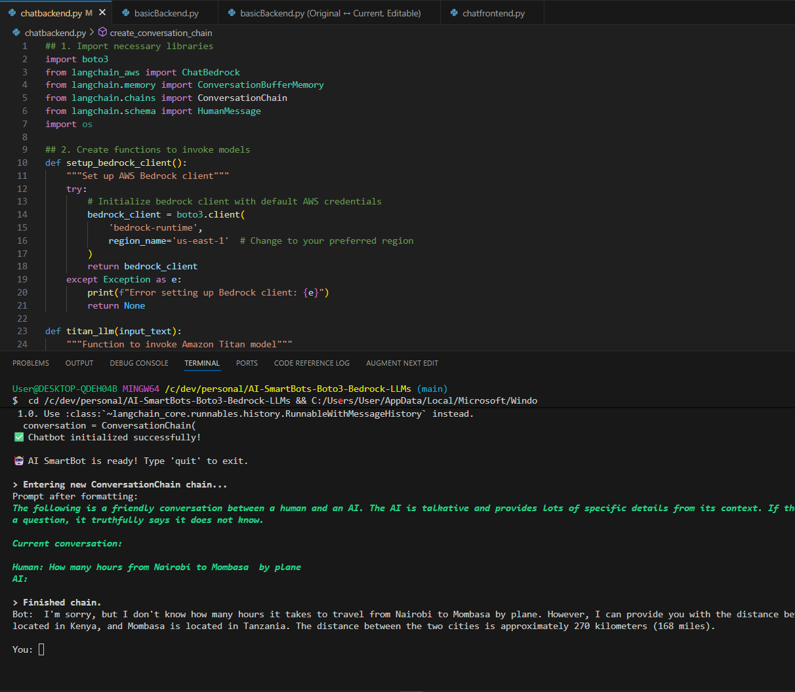

# AI SmartBot - AWS Bedrock & LangChain 🤖

An intelligent chatbot powered by AWS Bedrock (Amazon Titan LLM) and LangChain, with both CLI and Streamlit web interfaces.



## 🌟 Features

- **🤖 AWS Bedrock Integration** - Uses Amazon Titan Text Lite model
- **💬 Conversation Memory** - Maintains context using ConversationSummaryBufferMemory
- **🖥️ Dual Interface** - Command-line and web UI options
- **🔄 Session Management** - Per-session memory with automatic summarization
- **⚡ Real-time Responses** - Fast streaming responses from AWS Bedrock
- **🎨 Modern UI** - Clean, responsive Streamlit interface

## 📸 Screenshots

### Web Interface


### CLI Interface


## 🚀 Quick Start

### Prerequisites

1. **Python 3.13+** installed
2. **AWS Account** with Bedrock access
3. **Model Access** enabled for `amazon.titan-text-lite-v1` in `us-east-1`
4. **AWS Credentials** configured

### Installation

```bash
# Clone the repository
git clone https://github.com/Alamin-Juma/AI-SmartBot-Boto3-PY-Bedrock-LangChain.git
cd AI-SmartBot-Boto3-PY-Bedrock-LLMs

# Install dependencies
pip install boto3 streamlit langchain langchain-aws langchain-community transformers

# Configure AWS credentials
aws configure
```

### Running the Application

#### Option 1: Web Interface (Recommended)

**Basic Version:**
```bash
python -m streamlit run basicFrontend.py
```

**Advanced Version:**
```bash
python -m streamlit run chatfrontend.py
```

Then open your browser to `http://localhost:8501`

#### Option 2: Command Line Interface

**Basic Version:**
```bash
python basicBackend.py
```

**Advanced Version:**
```bash
python chatbackend.py
```

Type your questions at the prompt and press Enter. Type `quit` to exit.

## 📁 Project Structure

```
AI-SmartBots-Boto3-Bedrock-LLMs/
├── basicBackend.py        # Simple backend implementation
├── basicFrontend.py       # Simple Streamlit UI
├── chatbackend.py         # Advanced backend with ChatbotManager
├── chatfrontend.py        # Advanced Streamlit UI
├── image.png             # Screenshot 1
├── image copy.png        # Screenshot 2
├── docs/
│   └── RUNNING.md        # Detailed usage guide
└── README.md             # This file
```

## 🛠️ Technology Stack

- **AWS Bedrock** - Managed AI service for foundation models
- **Amazon Titan** - LLM for text generation
- **LangChain** - Framework for LLM applications
- **Streamlit** - Web UI framework
- **Boto3** - AWS SDK for Python

## ⚙️ Configuration

### Model Parameters

| Parameter | Value | Description |
|-----------|-------|-------------|
| Model | `amazon.titan-text-lite-v1` | Amazon Titan Lite model |
| Region | `us-east-1` | AWS region |
| Temperature | `0.5` - `1.0` | Response creativity |
| Max Tokens | `2048` | Maximum response length |
| Top P | `0.5` - `0.9` | Sampling parameter |

### Memory Settings

- **Token Limit:** 512 (basic) / 1500 (advanced)
- **Memory Type:** ConversationSummaryBufferMemory
- **Session Management:** Per-session isolation

## 📖 Documentation

For detailed usage instructions, troubleshooting, and best practices, see:
- [Running Guide](docs/RUNNING.md) - Complete setup and usage documentation

## 🔒 AWS Bedrock Setup

1. **Enable Model Access:**
   - Go to AWS Console → Bedrock → Model Access
   - Request access for "Amazon Titan Text Lite v1"
   - Wait for approval (usually instant)

2. **IAM Permissions Required:**
   ```json
   {
     "Version": "2012-10-17",
     "Statement": [
       {
         "Effect": "Allow",
         "Action": [
           "bedrock:InvokeModel",
           "bedrock:ListFoundationModels"
         ],
         "Resource": "*"
       }
     ]
   }
   ```

3. **Configure Credentials:**
   ```bash
   aws configure
   # Enter your AWS Access Key ID
   # Enter your AWS Secret Access Key
   # Default region: us-east-1
   # Default output format: json
   ```

## 🐛 Troubleshooting

### Common Issues

**Access Denied Error:**
- Ensure Bedrock model access is enabled in AWS Console
- Check IAM permissions include `bedrock:InvokeModel`

**Streamlit Command Not Found:**
- Use `python -m streamlit run` instead of `streamlit run`

**Module Import Errors:**
```bash
pip install langchain-aws langchain-community transformers
```

**PyTorch/TensorFlow Warning:**
- Safe to ignore - not required for AWS Bedrock

See [RUNNING.md](docs/RUNNING.md) for more troubleshooting tips.

## 🤝 Contributing

Contributions are welcome! Please feel free to submit a Pull Request.

## 📝 License

This project is part of a learning journey with AWS Bedrock and LangChain.

## 👨‍💻 Author

**Alamin Juma**
- GitHub: [@Alamin-Juma](https://github.com/Alamin-Juma)
- Repository: [AI-SmartBot-Boto3-PY-Bedrock-LangChain](https://github.com/Alamin-Juma/AI-SmartBot-Boto3-PY-Bedrock-LangChain)

## 🙏 Acknowledgments

- AWS Bedrock team for the amazing foundation models
- LangChain community for the excellent framework
- Streamlit for the intuitive UI framework

---

**Built with ❤️ using AWS Bedrock, LangChain, and Streamlit**