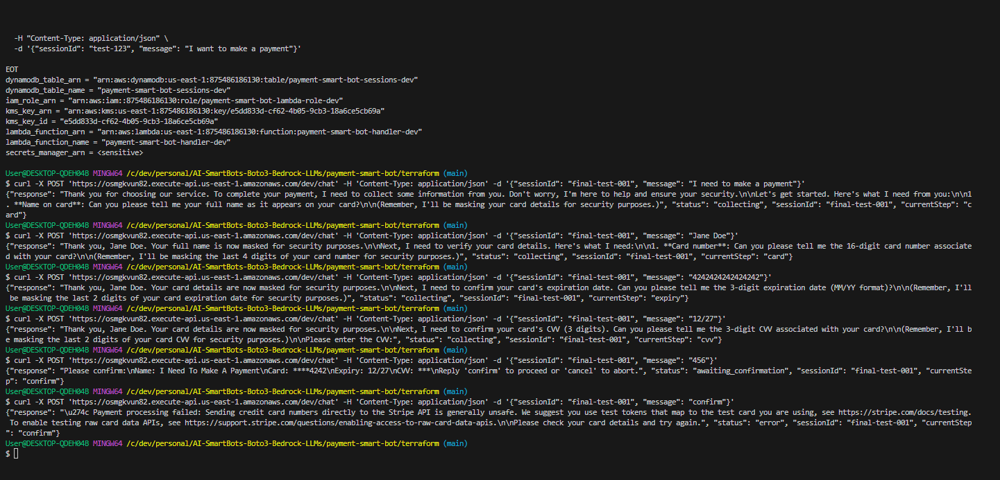

# Running Payment Smart Bot 💳🤖

This guide shows you how to run the Payment Smart Bot frontend interface.

## Prerequisites

### Required Software
- **Python 3.13** installed at:
  ```
  C:/Users/User/AppData/Local/Microsoft/WindowsApps/python3.13.exe
  ```
- **Git Bash** or similar terminal (for Windows)

### Backend Requirements
- **AWS Infrastructure**: Lambda + API Gateway (already deployed via Terraform)
- **API Endpoint**: `https://osmgkvun82.execute-api.us-east-1.amazonaws.com/dev/chat`
- **Backend Status**: ✅ Always running (serverless, no manual start needed)

### Python Dependencies
Required packages:
```bash
pip install streamlit requests python-dotenv pillow
```

---

## 🚀 Quick Start

### Method 1: Using Quick Start Scripts

**Windows PowerShell:**
```powershell
cd C:/dev/personal/AI-SmartBots-Boto3-Bedrock-LLMs/payment-smart-bot/frontend
./start.ps1
```

**Git Bash (Linux/Mac style):**
```bash
cd /c/dev/personal/AI-SmartBots-Boto3-Bedrock-LLMs/payment-smart-bot/frontend
./start.sh
```

### Method 2: Direct Streamlit Command (Recommended for Windows)

```bash
cd /c/dev/personal/AI-SmartBots-Boto3-Bedrock-LLMs/payment-smart-bot/frontend
C:/Users/User/AppData/Local/Microsoft/WindowsApps/python3.13.exe -m streamlit run payment_bot_frontend.py
```

**Expected output:**
```
  You can now view your Streamlit app in your browser.

  URL: http://localhost:8501
```

### Method 3: Docker (Optional)

```bash
cd /c/dev/personal/AI-SmartBots-Boto3-Bedrock-LLMs/payment-smart-bot/frontend
docker-compose up -d
```

---

## ⚙️ Configuration

### API Endpoint Setup

The frontend needs to know where your backend API is located. You have two options:

#### Option 1: Environment File (Persistent)

1. The `.env` file should already have the correct endpoint:
   ```env
   PAYMENT_BOT_API_ENDPOINT=https://osmgkvun82.execute-api.us-east-1.amazonaws.com/dev/chat
   ```

2. If not, create/edit the file:
   ```bash
   cd /c/dev/personal/AI-SmartBots-Boto3-Bedrock-LLMs/payment-smart-bot/frontend
   cp .env.example .env
   nano .env  # or use notepad
   ```

#### Option 2: Configure in UI (Quick Start)

1. Open the app at `http://localhost:8501`
2. Look at the **sidebar** on the left
3. Find **"🔗 API Settings"** section
4. Enter the API endpoint:
   ```
   https://osmgkvun82.execute-api.us-east-1.amazonaws.com/dev/chat
   ```
5. The app will reload automatically

---

## 💳 Using the Payment Bot

### Enable Test Mode

1. In the sidebar, find **"🧪 Test Mode"** toggle
2. Turn it **ON** (should be on by default)
3. You'll see: **"Test Mode Active - Use test card: 4242424242424242"**

### Test Cards for Demo

```
Card Number:  4242 4242 4242 4242  (Visa - Success)
              5555 5555 5555 4444  (Mastercard - Success)
              4000 0000 0000 0002  (Declined)

Expiry:       12/25 (any future date)
CVV:          123 (any 3 digits)
Name:         John Smith (any name)
```

### Complete Payment Flow

#### Step 1: Start Conversation
Click **"💳 Make a Payment"** button or type "I want to make a payment"

#### Step 2: Provide Information
The bot will ask for:
1. **Name**: "John Smith"
2. **Card Number**: "4242424242424242"
3. **Expiration**: "12/25"
4. **CVV**: "123"

#### Step 3: Confirm
- Bot shows masked information
- Type "confirm" to proceed
- Payment token generated via Stripe

#### Step 4: Success
- ✅ Payment processed message
- Token displayed (starts with `tok_`)

---

## 🎨 Frontend Features

### Main Interface
- **Security Banner**: Shows encryption and PCI compliance
- **Status Badge**: Shows current state (Collecting, Confirming, Completed)
- **Chat Area**: Real-time conversation with AI bot
- **Progress Bar**: Visual indicator of payment flow completion (0-100%)

### Sidebar Features
- **Configuration**
  - API endpoint input
  - Test mode toggle
  
- **Session Info**
  - Session ID (unique identifier)
  - Message count
  - Current status
  
- **Progress Tracking**
  - Visual progress bar
  - Percentage complete
  
- **Actions**
  - 🔄 New Session - Start fresh conversation
  - 📋 Copy Session ID - For tracking/support
  
- **Security Features List**
  - 🔒 End-to-end encryption
  - 🛡️ PCI-DSS compliant
  - 🔑 Stripe tokenization
  - 📊 Real-time fraud detection
  - ⏰ Session auto-expiry
  - 🚫 No data storage

### Quick Actions
- **💳 Make a Payment** - Starts payment flow
- **🔍 Check Payment Status** - Query current status
- **❓ Get Help** - Get assistance

---

## 🔍 Troubleshooting

### Common Issues

#### 1. "API endpoint not configured" Warning

**Symptom:** Orange warning at top of page

**Solution:**
- Configure endpoint in sidebar, OR
- Edit `.env` file with correct API endpoint

#### 2. Frontend Won't Start

**Error:** `streamlit: command not found`

**Solution:** Use full Python path:
```bash
C:/Users/User/AppData/Local/Microsoft/WindowsApps/python3.13.exe -m streamlit run payment_bot_frontend.py
```

#### 3. Messages Not Sending

**Symptom:** Type message but no response

**Check:**
1. Is API endpoint configured? (Check sidebar)
2. Is backend running? (Test with curl):
   ```bash
   curl -X POST 'https://osmgkvun82.execute-api.us-east-1.amazonaws.com/dev/chat' \
     -H 'Content-Type: application/json' \
     -d '{"sessionId":"test","message":"Hi"}'
   ```
3. Check browser console (F12) for errors

#### 4. "Request timed out" Error

**Causes:**
- Lambda cold start (first request takes longer)
- Network issues
- Backend not deployed

**Solution:**
- Wait 30 seconds and try again
- Check AWS Lambda is deployed: `cd terraform && terraform state list`
- Verify API endpoint is correct

#### 5. Config Warnings (Safe to Ignore)

**Warnings:**
```
"logger.enableRichLogs" is not a valid config option
"deprecation.showPyplotGlobalUse" is not a valid config option
```

**Status:** ✅ Safe to ignore - These are removed config options in newer Streamlit versions. The app works fine.

---

## 🛡️ Security Notes

### What the Frontend Does
- ✅ Displays chat interface
- ✅ Sends messages to backend API
- ✅ Shows security indicators
- ✅ Never stores sensitive data locally

### What the Frontend Does NOT Do
- ❌ Does not process payments directly
- ❌ Does not store card numbers
- ❌ Does not access Stripe API directly

### Data Flow
```
User → Frontend (Streamlit) → API Gateway → Lambda → Bedrock + Stripe
                                                    ↓
                                            DynamoDB Sessions
```

All sensitive data is handled by the backend in AWS.

---

## 📊 Backend Status

### How to Check Backend is Running

**Method 1: Terraform State**
```bash
cd /c/dev/personal/AI-SmartBots-Boto3-Bedrock-LLMs/payment-smart-bot/terraform
terraform state list
```

Should show ~30 AWS resources including:
- `aws_lambda_function.payment_handler`
- `aws_api_gateway_rest_api.main`
- `aws_dynamodb_table.sessions`

**Method 2: Test API Directly**
```bash
curl -X POST 'https://osmgkvun82.execute-api.us-east-1.amazonaws.com/dev/chat' \
  -H 'Content-Type: application/json' \
  -d '{"sessionId":"test-001","message":"Hello"}'
```

Should return JSON with `response`, `status`, and `sessionId`.

**Method 3: AWS Console**
- Go to AWS Lambda console
- Find: `payment-smart-bot-handler-dev`
- Status should be: **Active**

### Backend is Serverless
- ❌ No manual "start" needed
- ✅ Always available 24/7
- ✅ Auto-scales with traffic
- ✅ Pay only when used

---

## 💡 Tips & Best Practices

### For Testing
- Always use **Test Mode** for development
- Use Stripe test cards (4242...)
- Check CloudWatch logs if issues occur
- Monitor progress bar to track flow

### For Development
- Use browser DevTools (F12) to debug
- Check Network tab for API calls
- Console shows any JavaScript errors
- Streamlit auto-reloads on code changes

### For Production (Future)
- Disable test mode
- Use real Stripe keys
- Add custom domain to API Gateway
- Enable CloudWatch alarms
- Consider Stripe Elements integration

---

## 📸 Screenshots

### Main Interface


*Secure payment collection with AI-powered conversation*

---

## 🔗 Related Documentation

- **[Frontend README](README.md)** - Detailed frontend documentation
- **[Frontend Guide](../docs/FRONTEND_GUIDE.md)** - Visual UI walkthrough
- **[Deployment Guide](../docs/DEPLOYMENT_GUIDE.md)** - Backend deployment
- **[Troubleshooting](../docs/TROUBLESHOOTING.md)** - Error solutions
- **[Quick Reference](../QUICK_REFERENCE.md)** - Quick commands

---

## 📝 Summary

### To Run Payment Bot Frontend:

```bash
# Navigate to frontend directory
cd /c/dev/personal/AI-SmartBots-Boto3-Bedrock-LLMs/payment-smart-bot/frontend

# Run with full Python path
C:/Users/User/AppData/Local/Microsoft/WindowsApps/python3.13.exe -m streamlit run payment_bot_frontend.py

# Access in browser
http://localhost:8501

# Configure API endpoint in sidebar
https://osmgkvun82.execute-api.us-east-1.amazonaws.com/dev/chat

# Enable test mode and try a payment!
```

**Backend Status:** ✅ Already running (AWS Lambda - serverless)  
**Frontend Status:** ▶️ Starts when you run the command above  
**API Connection:** Configure in UI sidebar or `.env` file

---

**Built with ❤️ using Streamlit, AWS Bedrock, and Stripe**

**Status:** ✅ Production Ready  
**Last Updated:** October 15, 2025
