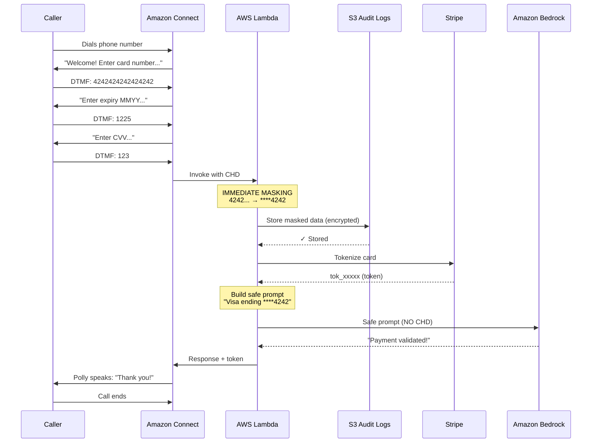
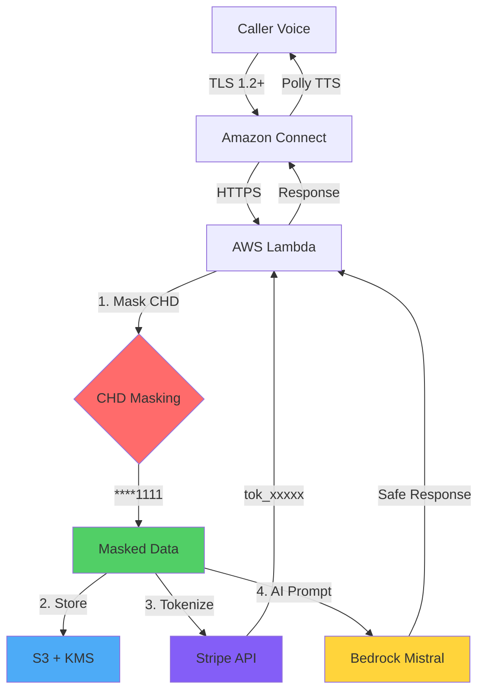
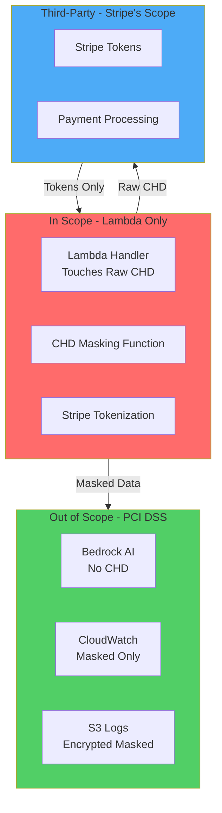
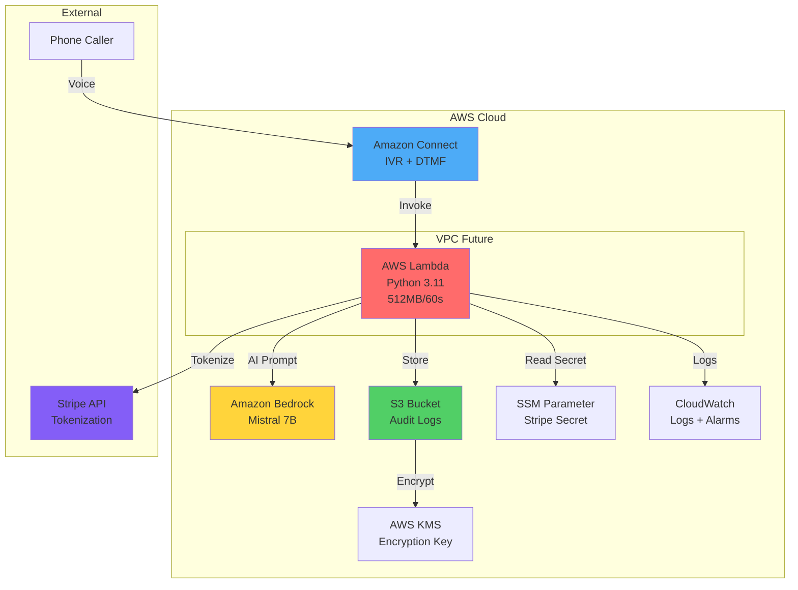
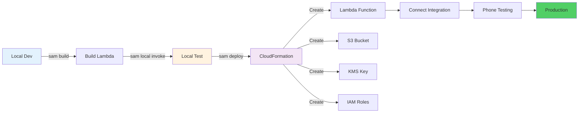
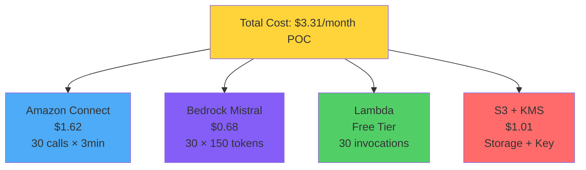
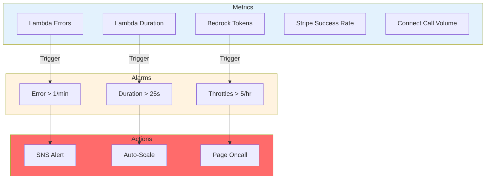

# Architecture Diagrams (Mermaid Format)

## Call Flow Sequence Diagram

---

## Data Flow Diagram

---

## Security Layers Diagram

```mermaid
flowchart LR
    subgraph Layer1[Network Security]
        A1[TLS 1.2+]
        A2[HTTPS Only]
        A3[VPC Isolation]
    end
    
    subgraph Layer2[Data Masking]
        B1[Immediate CHD Mask]
        B2[Tokenization]
        B3[No CHD to AI]
    end
    
    subgraph Layer3[Encryption]
        C1[S3 + KMS]
        C2[SSM Secrets]
        C3[CloudWatch Encrypted]
    end
    
    subgraph Layer4[Access Control]
        D1[IAM Least Privilege]
        D2[MFA Required]
        D3[Audit Logging]
    end
    
    Layer1 --> Layer2
    Layer2 --> Layer3
    Layer3 --> Layer4
    
    style Layer1 fill:#e3f2fd
    style Layer2 fill:#f3e5f5
    style Layer3 fill:#e8f5e9
    style Layer4 fill:#fff3e0
```

---

## PCI Compliance Boundary

---

## Infrastructure Architecture

---

## Deployment Pipeline

---

## Cost Breakdown Flow

---

## Monitoring Dashboard

---

## To view these diagrams:

1. **GitHub**: Automatically renders Mermaid
2. **VS Code**: Install "Markdown Preview Mermaid Support" extension
3. **Online**: Copy to https://mermaid.live/

These diagrams provide visual representation of the PCI-compliant architecture.
